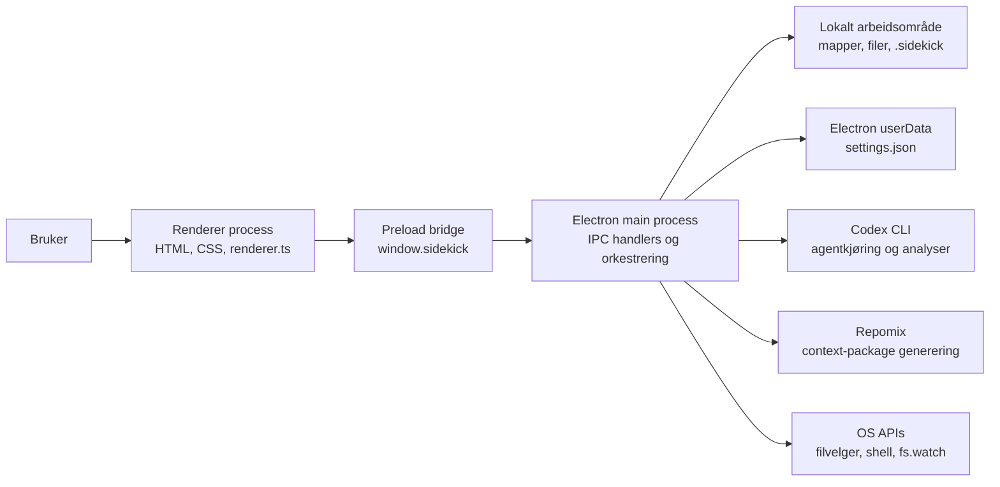
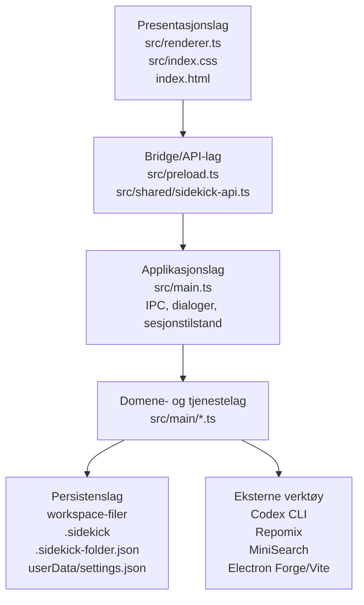
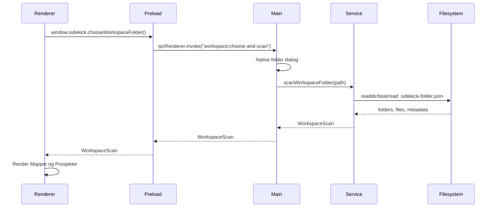
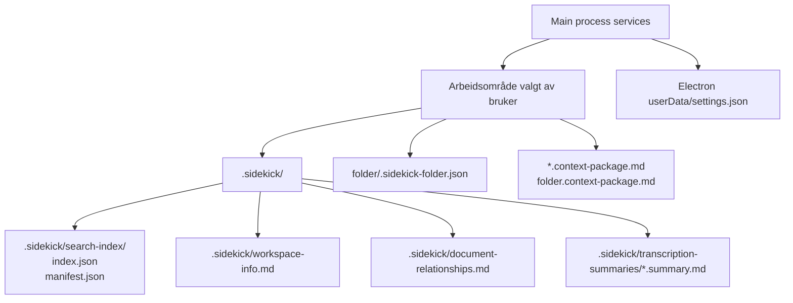
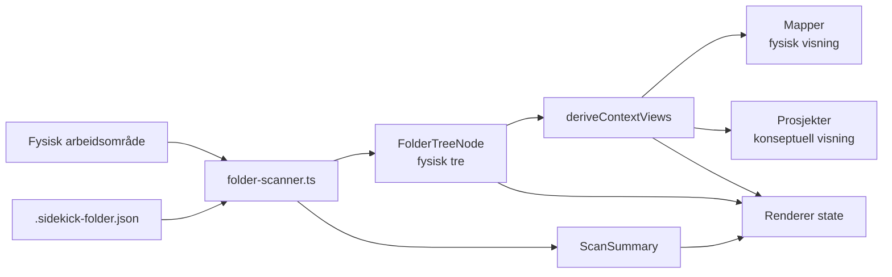
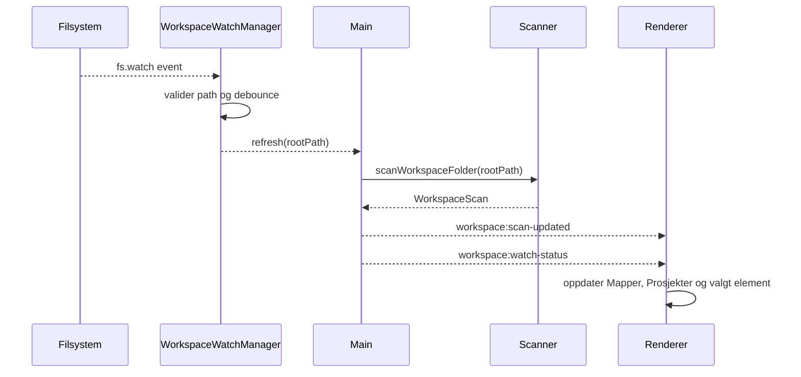
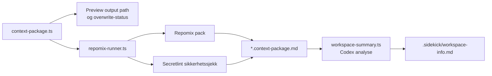

# Løsningsarkitektur

Status: Gjeldende teknisk beskrivelse
Oppdatert: 2026-05-18
Grunnlag: Static analysis dokumentert i `../static-analysis/2026-05-18-static-analysis-solution-architecture.md`

## Formål

Dette dokumentet beskriver hvordan Sidekick er bygget teknisk. Det skal gi utviklere, konsulenter og design-/produktarbeid et felles bilde av komponenter, lagdeling, API-er, persistens og dataflyt.

Sidekick er en lokal-first Electron desktop-applikasjon. Det finnes ingen serverbackend og ingen klassisk database. "Backend" i Sidekick betyr Electron main process, som kjører lokalt på brukerens maskin og har kontrollert tilgang til filsystem, native dialoger, eksterne prosesser og lokal persistens.

## Overordnet Runtime



Hovedregelen er at renderer aldri leser eller skriver filsystemet direkte. Renderer ber om en konkret Sidekick-kapasitet via `window.sidekick`. Preload oversetter dette til en navngitt IPC-kanal. Main process validerer input, utfører privilegert arbeid og returnerer typed DTO-er.

## Lagdeling



### Presentasjonslag

Presentasjonslaget består primært av:

- `src/renderer.ts` - UI-state, handlinger, rendering av arbeidsområde, views, høyre panel, Codex-panel, importflyt, søk og tagging.
- `src/index.css` - visuell struktur og komponentstiler.
- `src/index.html` - renderer entrypoint.

Renderer holder applikasjonstilstand for aktivt arbeidsområde, valgt rad, aktiv kontekstvisning, statusmeldinger, søk og pågående brukerflyter. Den bruker bare `window.sidekick` som systemgrense ut av renderer.

### Bridge/API-lag

Bridge-laget består av:

- `src/preload.ts` - eksponerer `window.sidekick` gjennom `contextBridge`.
- `src/shared/sidekick-api.ts` - definerer alle DTO-er, resultater, statusobjekter og `SidekickApi`.

Preload eksponerer kun task-spesifikke metoder. Den eksponerer ikke raw `ipcRenderer`, `fs`, `process`, `shell` eller generiske systemprimitiver.

### Applikasjonslag

`src/main.ts` er applikasjonsorkestratoren. Den:

- setter opp Electron-app, BrowserWindow og sikkerhetsinnstillinger;
- registrerer IPC handlers;
- holder prosesslokal sesjonstilstand som valgte arbeidsområder og pending preview-flyter;
- validerer at renderer bare kan handle på arbeidsområder valgt eller opprettet i Sidekick;
- kobler main-process tjenester til renderer-events;
- starter og stopper søkeindeks, workspace-watcher og Codex-runner.

Dette laget skal ikke vokse til å inneholde tung domenelogikk. Domenelogikk ligger i moduler under `src/main/`.

### Domene- og Tjenestelag

Main-process tjenester har ansvar for filsystem, analyser, metadata, prosesser og genererte artefakter. Viktige moduler:

| Modul | Ansvar |
| --- | --- |
| `folder-scanner.ts` | Leser arbeidsområdet, klassifiserer filer og mapper, leser folder metadata, lager `WorkspaceScan`. |
| `context-metadata.ts` | Leser og skriver `.sidekick-folder.json`, normaliserer tagger og systemtagger. |
| `shared/context-views.ts` | Lager konseptuelle visninger som `Mapper` og `Prosjekter` fra samme fysiske scan. |
| `workspace-creator.ts` | Oppretter nytt arbeidsområde med standardmapper. |
| `workspace-initializer.ts` | Initierer eksisterende mappe som arbeidsområde. |
| `workspace-watch-manager.ts` | Lytter på filsystemendringer og trigger ny scan for aktivt arbeidsområde. |
| `context-package.ts` | Forhåndsviser og genererer workspace- eller folder-scoped context packages. |
| `repomix-runner.ts` | Kjører Repomix in-process med sikkerhetssjekk og Electron-tilpasset tokenmåling. |
| `workspace-info.ts` | Leser og skriver `.sidekick/workspace-info.md`. |
| `document-relationships.ts` | Genererer og leser `.sidekick/document-relationships.md`. |
| `transcription-importer.ts` | Importerer transkripsjoner trygt med nummerering og uten overwrite. |
| `transcription-summary.ts` | Leser og genererer transkripsjonssammendrag i `.sidekick/transcription-summaries/`. |
| `transcription-summary-batch.ts` | Lager batch-preview og batch-generering for eksisterende transkripsjoner. |
| `search-index.ts` | Bygger, lagrer, oppdaterer og søker i lokal MiniSearch-indeks. |
| `codex-runner.ts` | Finner Codex CLI, sjekker login/status, starter, strømmer og kansellerer Codex-prosesser. |
| `settings-store.ts` | Leser og skriver appinnstillinger i Electron `userData`. |

## Frontend og Backend



I Sidekick er frontend og backend ikke adskilt som webklient og server. De er adskilt som Electron renderer og Electron main:

- Frontend: renderer process. Ansvarlig for visning, interaksjon og lokal UI-state.
- Backend: main process. Ansvarlig for filsystem, native OS-integrasjon, eksterne prosesser, validering, persistens og domenetjenester.
- Kontrakt: `SidekickApi`. Alle kall og events går gjennom preload.

Denne strukturen er sikkerhetskritisk. Endringer som flytter filsystemtilgang, Codex-kjøring eller native Electron APIs inn i renderer bryter arkitekturgrensen.

## API-Flater

Sidekick har én intern renderer-til-main API-flate: `SidekickApi` i `src/shared/sidekick-api.ts`.

### Kommando-API-er

| Område | Metoder |
| --- | --- |
| App | `getAppInfo` |
| Arbeidsområde | `chooseWorkspaceFolder`, `chooseWorkspaceParentFolder`, `createWorkspaceFolder`, `chooseWorkspaceFolderForInitialization`, `confirmWorkspaceInitialization` |
| Context package | `previewContextPackage`, `generateContextPackage`, `previewFolderContextPackage`, `generateFolderContextPackage` |
| Workspace info | `readWorkspaceInfo` |
| Dokumentrelasjoner | `readDocumentRelationships`, `generateDocumentRelationships` |
| Transkripsjon | `previewTranscriptionImport`, `confirmTranscriptionImport`, `readTranscriptionSummary`, `previewTranscriptionSummaryBatch`, `confirmTranscriptionSummaryBatch` |
| Søk | `getSearchIndexStatus`, `refreshSearchIndex`, `searchWorkspace` |
| Folder tags | `addFolderTag`, `removeFolderTag` |
| Codex | `getCodexStatus`, `startCodexLogin`, `startCodexRun`, `cancelCodexRun` |
| Settings | `getSettings`, `chooseCodexPath`, `saveCodexPath`, `resetCodexPath`, `testCodexPath` |

### Event-API-er

| Event | Bruk |
| --- | --- |
| `onCodexOutput` | Streamer stdout/stderr og parsed JSONL fra Codex-kjøring. |
| `onCodexCompletion` | Varsler ferdig, feilet eller kansellert Codex-run. |
| `onSearchIndexStatus` | Oppdaterer søkestatus ved indeksering og refresh. |
| `onWorkspaceScanUpdated` | Sender ny `WorkspaceScan` når filsystemet endres. |
| `onWorkspaceWatchStatus` | Viser status for live workspace refresh. |

Main process registrerer tilsvarende `ipcMain.handle(...)` og sender eventer med `webContents.send(...)`.

## Persistens og Databaser

Sidekick bruker ingen database-server, SQLite eller embedded objektstore i dagens løsning. Persistens er filbasert.



### Arbeidsområde

Et arbeidsområde er en vanlig mappe på brukerens maskin. Når Sidekick oppretter et arbeidsområde, opprettes disse standardmappene:

- `00. Forutsetninger`
- `01. Notater`
- `02. Transkripsjoner`

Arbeidsområdet er fortsatt brukerens filstruktur. Sidekick legger metadata og genererte artefakter ved siden av brukerens filer, men skal ikke kreve at brukeren arbeider kun gjennom Sidekick.

### `.sidekick/`

`.sidekick/` er Sidekicks workspace-lokale metadataområde. Det brukes til:

- `workspace-info.md` - generert prosjektsammendrag for hele arbeidsområdet.
- `document-relationships.md` - generert relasjonsanalyse på tvers av dokumenter.
- `search-index/index.json` - serialisert MiniSearch-indeks.
- `search-index/manifest.json` - manifest med indekserte filer, hash, mtime og skip-årsaker.
- `transcription-summaries/*.summary.md` - samtalesammendrag for transkripsjoner, keyed med hash av workspace-relativ sti.

`.sidekick/` skjules fra ordinær scanning, context-package-generering og workspace-refresh-støy der det er relevant.

### `.sidekick-folder.json`

Mapper kan ha en lokal markerfil:

```text
<folder>/.sidekick-folder.json
```

Denne filen er Sidekicks konseptuelle metadata for en mappe. Den inneholder schema, folderId, timestamps og tagger. Systemtaggen `Prosjektmappe` har systemeffekt `project-root`, og gjør at mappen opptrer som et prosjekt i `Prosjekter`-visningen.

Markerfilen ligger i selve mappen fordi metadata skal følge mappen når brukeren flytter den i en ekstern editor. Scanneren oppdager konflikter dersom samme `folderId` finnes flere steder.

### Context Packages

Context packages skrives som Markdown-filer:

- `<workspace-name>.context-package.md` i workspace root.
- `<folder-name>.context-package.md` i valgt folder for folder-scoped pakker.

Genererte context-package-filer ignoreres i senere generering for å unngå rekursiv vekst.

### App Settings

Globale appinnstillinger lagres i:

```text
<Electron userData>/settings.json
```

Dagens innstilling er `sidekick_codex_path`, som kan peke på en eksplisitt Codex CLI executable. `SIDEKICK_CODEX_PATH` i miljøet overstyrer lagret verdi.

## Arbeidsområde, Scanning og Kontekstvisninger



`scanWorkspaceFolder` er sentral i informasjonsmodellen. Den lager ett `WorkspaceScan`-objekt som inneholder:

- fysisk tre av mapper og filer;
- klassifisering av artefakter;
- context hints basert på fil- og mappenavn;
- folder metadata og tagger;
- scan warnings;
- summary-tall;
- avledede context views.

`Mapper` er den fysiske visningen. `Prosjekter` er en konseptuell visning av samme underliggende innhold, avledet fra tagger og fysisk struktur.

## Live Filsystemoppdatering



`workspace-watch-manager.ts` lytter på aktivt arbeidsområde og relevante undermapper. Filsystemevents behandles som hint, ikke som sannhet. Etter debounce kjører main en full scan og sender ny `WorkspaceScan` til renderer.

Ignorerte områder inkluderer blant annet `.git`, `.sidekick`, `node_modules`, build-output og genererte context packages. `.sidekick-folder.json` ignoreres ikke, fordi den påvirker konseptuelle visninger.

## Søk

Søk er en lokal MiniSearch-basert indeks i main process. Indeksen:

- indekserer tekstlige filtyper som Markdown, tekst, JSON, YAML, HTML, CSS, JS og TS;
- ignorerer `.sidekick`, skjulte mapper, build-output og genererte context packages;
- skipper binære, oversize og unsupported filer med manifestert årsak;
- lagrer `index.json` og `manifest.json` under `.sidekick/search-index/`;
- har egne status-events til renderer.

Søket er en brukerfunksjon, ikke source of truth. Source of truth for struktur er fortsatt workspace-scan.

## Codex og Generative Arbeidsflyter

Codex integrasjonen ligger i `codex-runner.ts` og brukes av:

- kontrollert Codex-panel i UI;
- workspace summary;
- transcription summaries;
- document relationship analysis.

Codex kjøres som ekstern CLI-prosess. Sidekick:

- finner executable fra `SIDEKICK_CODEX_PATH`, lagret setting eller PATH;
- sjekker status og login;
- starter `codex exec` med kontrollert argumentliste;
- sender prompt via stdin;
- streamer JSONL/plain text tilbake til renderer;
- kan kansellere aktiv prosess;
- bruker `read-only` eller `workspace-write` sandbox mode etter valgt flyt.

Generative workflows skriver resultater tilbake som Markdown i arbeidsområdet, typisk under `.sidekick/`.

## Context Package Generering



Repomix kjøres in-process for å fungere i pakket Electron-app. Sidekick overstyrer token-metrics runner og sikkerhetssjekk slik at generated packages fungerer uten ekstern worker-fil inne i `app.asar`.

Context packages ignorerer sensitive og genererte områder:

- `.git/**`
- `.sidekick/**`
- `node_modules/**`
- `out/**`, `dist/**`, `.vite/**`, `.cache/**`
- `*.context-package.md`
- `.sidekick-folder.json`

## Transkripsjon

Transkripsjonsflyten består av:

- velg kildefil via native dialog;
- finn én transkripsjonsmappe basert på scan-signaler;
- lag preview med målfilnavn;
- kopier med streng nummerering og `COPYFILE_EXCL`;
- generer eller les samtalesammendrag med Codex;
- skriv sammendrag under `.sidekick/transcription-summaries/`.

Import overskriver ikke eksisterende filer. Dersom et navn blir tatt mellom preview og confirm, leser Sidekick folderen på nytt og prøver neste nummer.

## Metadata og Kontekstbasert Modell

Sidekick skiller mellom fysisk lagring og konseptuell visning:

- Fysisk lagring er mapper og filer i arbeidsområdet.
- Konseptuelle visninger er avledede tolkninger av samme innhold.
- Metadata i `.sidekick-folder.json` kobler fysiske mapper til konsepter.

Dagens konseptuelle modell har:

- `Mapper` - fysisk tre.
- `Prosjekter` - mapper tagget med `Prosjektmappe`, med filer under valgt prosjektrot.

Modellen er bygget slik at flere konsepter kan legges til senere, for eksempel Applikasjoner, Tema, Produktområde eller andre konteksttyper. Da bør nye systemtagger og context views legges til uten at renderer får direkte filsystemansvar.

## Sikkerhetsgrenser

Viktige grenser:

- Renderer er sandboxed og uten Node.
- Preload er eneste bro fra renderer til main.
- Main validerer alle workspace roots mot `selectedWorkspaceRoots`.
- Native dialoger brukes for å etablere tillit til valgte mapper og filer.
- Renderer kan ikke sende vilkårlige output paths for sensitive flyter som transkripsjonsimport. Confirm bruker server-side preview state.
- Folder tagging validerer relativ path, avviser root-tagging i denne versjonen og avviser `.sidekick`-metadata paths.
- Ekstern navigasjon åpnes kun som `https:` i OS-browser, og nye renderer-vinduer nektes.
- Codex-kjøring går gjennom fast argumentbygging og prompt via stdin.
- Search og scanning følger ikke symlinks som default.

## Test og CI

Test- og byggverktøy:

- TypeScript og Vite for kompilering.
- ESLint for linting.
- Vitest for unit/integration tests.
- Playwright for Electron smoke/e2e.
- Electron Forge for packaging.
- GitHub Actions for CI og release.

Viktige kommandoer:

- `npm run check` - samlet kontroll med lint, typecheck og tester.
- `npm run test` - Vitest.
- `npm run test:ui` - Playwright/Electron smoke.
- `npm run package` - Electron Forge package.
- `npm run make` - release artifacts.
- `npm run verify:packaged-context` - verifiserer pakket context-package-flyt.

## Release og Distribusjon

Release-oppsettet ligger i:

- `forge.config.ts`
- `scripts/ci/*.mjs`
- `.github/workflows/ci.yml`
- `.github/workflows/release.yml`

Applikasjonen pakkes med Electron Forge. Release-flowen bygger artifacts i GitHub Actions, bruker staged make artifacts og har støtte for signering/tillit slik dokumentert i eksisterende release- og task-dokumentasjon.

## Arkitektoniske Observasjoner

1. `src/renderer.ts` er den største modulen og bærer mye UI-state. Nye større UI-flater bør vurdere moduloppdeling.
2. `src/main.ts` er en tydelig orkestrator, men nærmer seg størrelsen der IPC-registrering kan deles per domene.
3. `src/shared/sidekick-api.ts` er en sentral kontrakt. Endringer her bør behandles som API-endringer mellom renderer, preload og main.
4. Sidekick har to watcher-mekanismer: workspace refresh og search index. De er separate i dag, men deler prinsippet om at filsystemevents er hint som må valideres.
5. `docs/architecture/application-architecture.md` finnes fortsatt, men har noen eldre formuleringer fra prosjektmappe-perioden. Dette dokumentet beskriver dagens workspace-, tagging-, context-view- og live-refresh-arkitektur.

## Endringsregler

Endringer bør oppdatere dette dokumentet når de påvirker:

- Electron process boundary eller sikkerhetsinnstillinger.
- `SidekickApi` eller IPC-kanaler.
- Workspace metadata schema eller `.sidekick-folder.json`.
- Persistente filer under `.sidekick/`.
- Search index storage eller update-modell.
- Context package generering.
- Codex execution model.
- Release, packaging eller signering.
